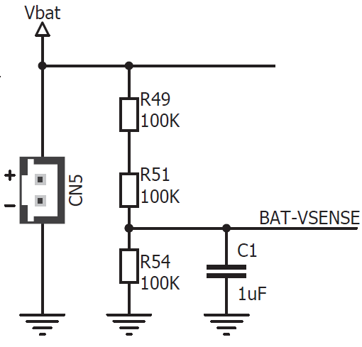

# Course project - Mine navigation search and rescue

## Challenge brief

Your task is to develop an autonomous robot that can navigate a "mine" using a series of instructions coded in coloured cards and return to its starting position.  Your robot must be able to perform the following: 

1. Navigate towards a coloured card and stop before impacting the card
1. Read the card colour
1. Interpret the card colour using a predefined code and perform the navigation instruction
1. When the final card is reached, navigate back to the starting position
1. Handle exceptions and return back to the starting position if final card cannot be found

## "Mine" environment specification

A "mine" is contstructed from black plywood walls 100mm high with some walls having coloured cards located on the sides of the maze to assist with navigation. The following colour code is to be used for navigation:

Colour | Instruction
---------|---------
Red | Turn Right 90
Green | Turn Left 90
Blue | Turn 180
Yellow | Reverse 1 square and turn right 90
Pink | Reverse 1 square and turn left 90
Orange | Turn Right 135
Light blue | Turn Left 135 
White | Finish (return home)
Black | Maze wall colour

Mine courses will vary in difficulty, with the simplest requiring 4 basic moves to navigate. More advanced courses may require 10 or moves to navigate. The mines may have features such as dead ends but colour cards will always direct you to the end of the maze. Once the end of the maze has been reached, you must return to the starting position. An example course to navigate is shown below. You do not know in advance which colours will be in the course or how many.

## Resources and project submission

To develop your solution you have your Clicker 2 board, buggy and colour click add on board. You must not use any hardware that is not provided as part of this course and you must use the XC8 compiler to compile your C code. 

Please use this GitHub repo to manage your software development and submit your project code. 

Final testing will take place in the CAGB foyer and testing areas will be provided around the mechatronics lab. You will not know the exact layout of the maze(s) in advance. You will also be asked to give a short presentation on the testing day.
## Solution Management and design
In order to give structure to our working, we produced a Gantt chart of tasks we felt needed to be done in design, implementation and testing phases with deadlines to keep progress on track. The tasks were also delegated so we could work in parallel to each other to increase efficiency. As with any project, we ran into hurdles and update the Gantt chart accordingly to add or remove tasks as neccesity prompted

(Insert GANTT)
## Supplementary technical information

### Additional buggy features

In addition to the motor drives we explored in lab 6, the buggy contains some additional features that may be of use during the project. The first feature is additional LEDs, controlled through the pins labelled **H.LAMPS**, **M.BEAM**, **BRAKE**, **TURN-L** and **TURN-R**. H.LAMPS turns on the front white LEDs and rear red LEDs, at a reduced brightness. M.BEAM and BRAKE enable you to turn these LEDs on at full brightness. The turn signals have not hardware based brightness control. These LEDs give you a method to provide feedback for debugging, in addition of the LEDs on the clicker board.

A further feature of the buggy is **BAT-VSENSE** pin which allows you to monitor the batter voltage via an analogue input pin. The battery is connected across a voltage divider, as shown in the diagram below:

The voltage at BAT-VSENSE will always be one third of that at the battery. Measuring this value can be useful for determining if your battery needs charging. You could also use it to calibrate your robot to perform well at different charge levels. 

## Solution Evolution
### Colour Calibration
Initially we planned to use raw RGB values from the converter but realised these fluctate a lot with light so instead moved to RGB values relative to total light however it was rather difficult to detect colours with relative values so we decided on Hue Values with the addition of the relative values to distinguish between colours with overlapping values.
